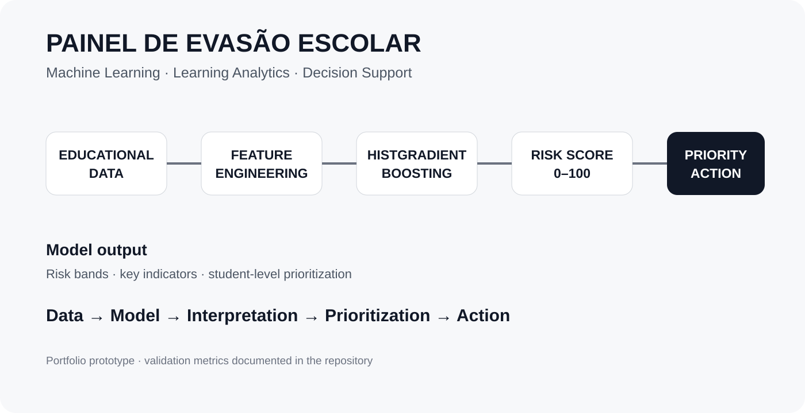

# Painel de Evasão Escolar — Machine Learning

## Projeto de Data Science aplicado à Educação

Sistema de **Learning Analytics + Machine Learning** desenvolvido para identificar estudantes com maior risco de evasão e transformar a predição em uma visão operacional para acompanhamento.




O projeto utiliza o modelo **V15.2 — HistGradientBoosting** para gerar um score de risco de 0 a 100 e organiza os principais fatores associados ao risco em dimensões como desempenho acadêmico, permanência, situação financeira, bolsa/desconto, frequência e comportamento.

> **Objetivo:** apoiar a identificação antecipada de estudantes que podem precisar de acompanhamento, transformando dados educacionais em informação acionável para equipes pedagógicas e de gestão.

### Preview


**Aplicação:** Streamlit  
**Modelo:** HistGradientBoosting  
**Abordagem:** Machine Learning + Learning Analytics  
**Score:** 0–100

---

## O problema

A evasão escolar normalmente é percebida depois que o aluno já apresenta um conjunto de sinais de afastamento.

A proposta deste projeto é utilizar dados históricos e indicadores educacionais para criar uma **visão preditiva**, permitindo que a instituição:

- identifique alunos em diferentes níveis de risco;
- priorize os casos que precisam de atenção;
- investigue os principais indicadores associados ao risco;
- transforme o score em uma ação de acompanhamento;
- acompanhe a população por meio de uma visão executiva e operacional.

O painel foi pensado para aproximar **Data Science, Learning Analytics e tomada de decisão**.

---

## Como funciona

```text
Dados educacionais
       ↓
Preparação e engenharia de atributos
       ↓
Modelo de Machine Learning
       ↓
Score de risco 0–100
       ↓
Classificação por faixa
       ↓
Identificação dos principais indicadores
       ↓
Priorização de acompanhamento
       ↓
Dashboard executivo + operacional
```

O aplicativo recebe a saída já escorada do modelo e apresenta duas perspectivas:

### Visão executiva

- quantidade de alunos monitorados;
- quantidade em risco Alto+;
- Top 10% para foco imediato;
- score médio;
- distribuição por faixa de risco;
- relação dos alunos mais críticos.

### Visão operacional

- busca por RA;
- filtros por faixa de risco;
- filtro Top 20%;
- seleção individual do aluno;
- score e prioridade;
- detalhamento por indicador;
- variáveis utilizadas em cada dimensão;
- ação recomendada para acompanhamento.

---

## Modelo preditivo

O modelo utilizado nesta versão é o **HistGradientBoosting**, identificado como **V15.2**.

O score produzido pelo modelo é convertido em uma escala de **0 a 100**, permitindo uma leitura operacional:

| Score | Faixa |
|---:|---|
| 0–19 | Muito baixo |
| 20–39 | Baixo |
| 40–59 | Médio |
| 60–79 | Alto |
| 80–100 | Muito alto |

### Indicadores utilizados

| Dimensão | Peso |
|---|---:|
| Desempenho | 20,53% |
| Permanência | 17,91% |
| Financeiro | 17,49% |
| Bolsa/desconto | 17,31% |
| Frequência | 17,30% |
| Comportamento | 9,46% |

O painel apresenta o detalhamento das variáveis que compõem essas dimensões.

---

## Resultados da validação

Na validação temporal documentada para a versão V15.2:

- **ROC AUC: 0,91**
- **Alcance de 75% dos casos no Top 20%**

Essas métricas descrevem a validação do modelo e não devem ser interpretadas como garantia de desempenho futuro em uma população diferente.

---

## Tecnologias

**Data Science / Machine Learning**
- Python
- Pandas
- NumPy
- Scikit-learn
- HistGradientBoosting
- Feature engineering
- Validação temporal

**Analytics / Aplicação**
- Streamlit
- Altair
- Excel/XLSX
- Dashboard interativo

**Conceitos**
- Learning Analytics
- Predição de risco
- Priorização
- Data-driven decision making
- Apoio à decisão

---

## Estrutura do projeto

```text
Painel-de-Evasao-Escolar/
│
├── app.py
├── dados/
├── painel
├── requirements.txt
└── README.md
```

### Principais componentes

**`app.py`**  
Aplicação Streamlit responsável pelo carregamento dos dados, normalização, enriquecimento, cálculo das dimensões de risco e visualização.

**`painel`**  
Imagem de referência/apresentação do projeto.

**`dados/`**  
Área destinada aos arquivos de dados locais. Dados reais de alunos não devem ser publicados em repositório público.

---

## Dados e privacidade

Este projeto pode trabalhar com informações educacionais potencialmente sensíveis.

Por isso, **dados reais de estudantes, RA, scores individuais ou informações financeiras não devem ser publicados em um repositório público**.

O aplicativo também possui suporte a dados sintéticos para demonstração.

Para uso com dados reais:

1. mantenha os arquivos fora do repositório público;
2. utilize upload local ou ambiente privado;
3. aplique as políticas de segurança e proteção de dados da instituição;
4. não utilize o score como decisão automática sobre o estudante.

---

## Rodar localmente

Clone o repositório e instale as dependências:

```bash
pip install -r requirements.txt
```

Execute:

```bash
streamlit run app.py
```

O aplicativo será disponibilizado localmente em:

```text
http://localhost:8501
```

Também é possível carregar uma planilha escorada pela barra lateral utilizando **Enviar planilha escorada (.xlsx)**.

---

## Formato esperado da saída do modelo

A aplicação reconhece a saída escorada do modelo, incluindo:

- `cd_ra`
- `SCORE_EVASAO`
- `dt_referencia`
- `FAIXA_RISCO`
- `PRIORIDADE`
- `ACAO_RECOMENDADA`

e as variáveis associadas às dimensões do modelo, como:

- média global;
- meses de permanência;
- valores em aberto;
- parcelas em atraso;
- inadimplência;
- bolsa;
- frequência;
- ocorrências comportamentais.

Por padrão, quando existem várias referências para o mesmo aluno, o painel utiliza a **referência mais recente**.

---

## Importante sobre interpretação

O score representa uma **estimativa de risco**, não uma sentença sobre o estudante.

O objetivo do sistema é apoiar profissionais na identificação de situações que merecem investigação e acompanhamento.

A decisão final deve considerar o contexto individual do aluno e a avaliação dos profissionais responsáveis.

---

## Sobre este projeto

Este projeto demonstra a aplicação prática de **Machine Learning em um problema real de negócio/educação**, indo além da construção de um modelo preditivo.

A proposta conecta:

**dados → modelo → interpretação → priorização → ação**

Essa camada de aplicação é importante porque um modelo de Machine Learning só gera valor quando seus resultados conseguem ser compreendidos e utilizados por quem toma decisões.

---

### Projeto de portfólio

**Data Science · Machine Learning · Learning Analytics · Python · Streamlit**

O repositório apresenta uma implementação demonstrável de um sistema preditivo aplicado à evasão escolar, incluindo modelagem, indicadores, validação e interface para exploração dos resultados.
